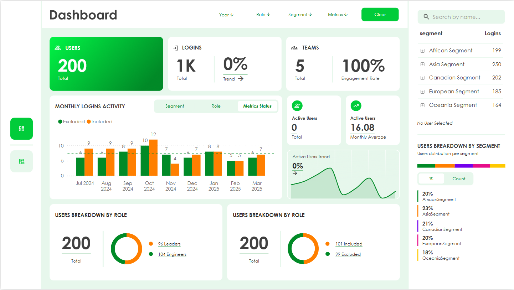
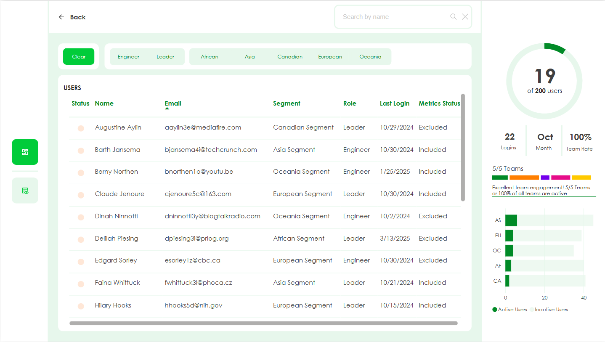
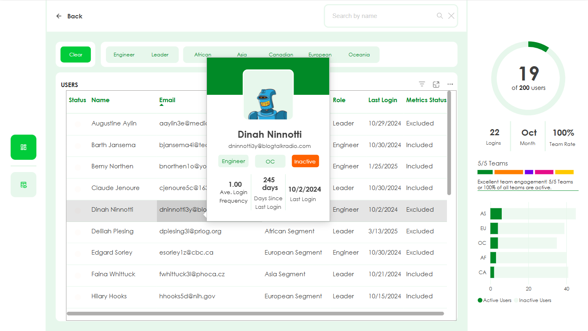
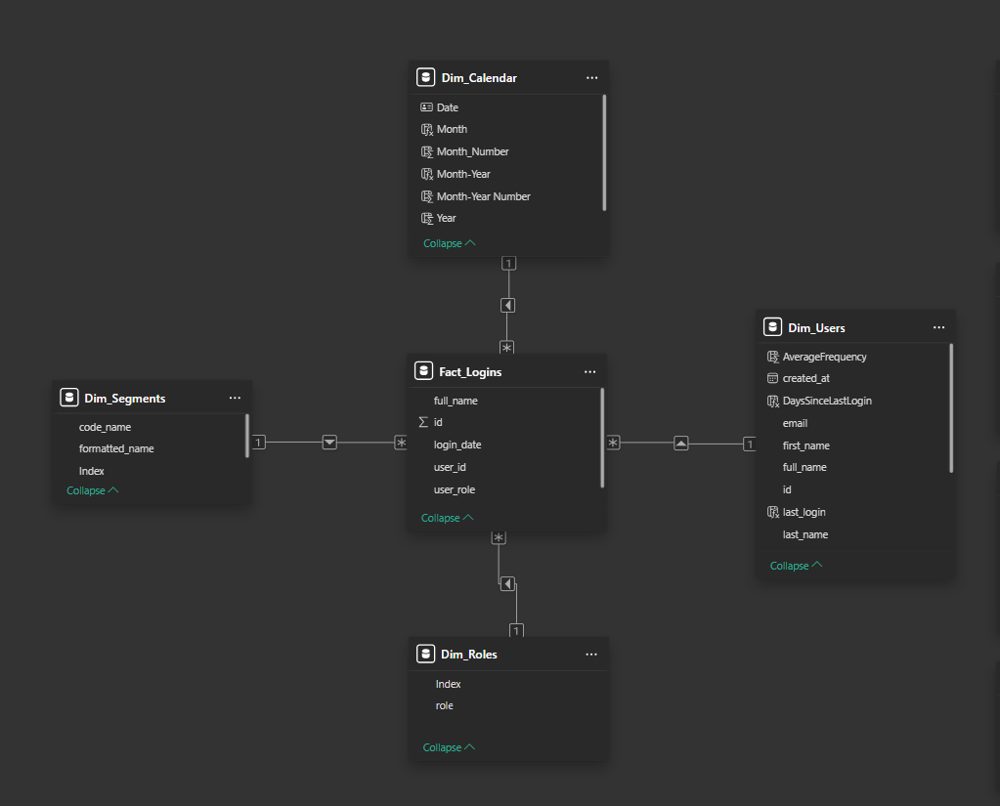

# 🚀 User Productivity & Engagement Dashboard | Power BI

## 🔎 Overview
This project delivers a highly interactive and modern **Power BI dashboard** to monitor **user productivity, engagement, and system usage trends** across an organization. It is built using mock APIs to simulate a real-world enterprise SaaS environment—ideal for product managers, HR analysts, and leadership teams.

## 🧠 Use Case
Organizations need actionable visibility into:
- Which teams are engaged.
- How frequently employees log in.
- Who is at risk of disengagement.

This dashboard solves that by providing **drillthrough insights**, **role-based breakdowns**, and **monthly activity patterns**.

## 🧩 Problem Statement
> Traditional employee productivity tools lack interactivity and user-level insights. Manual reports miss critical behavioral patterns—making it hard for managers to identify teams at risk of burnout or disengagement.

This project tackles that problem by **visualizing dynamic productivity KPIs** down to the employee level using intuitive charts, filterable metrics, and DAX logic.

## 💡 Features
- 📊 **Dynamic KPIs**: Total users, logins, active teams, engagement rate.
- 🔁 **Drillthrough Pages**: Click a bar chart to see detailed user logs by role, segment, or date.
- 🔍 **User Segmentation**: View engagement per geographic group or role (Leader vs Engineer).
- 📈 **Trend Analysis**: Monthly login chart and active user behavior over time.
- ✅ **Data Quality Metrics**: Status flags for login frequency and inclusion logic.

## 🏗️ Data Architecture
- **Data Source**: Mockaroo REST APIs (Users, Logins)
- **Data Model**: Star schema (Fact Logins + Dimension Tables)
- **Tools Used**:  
  - Power BI Desktop  
  - DAX (Data Analysis Expressions)  
  - Power Query for ETL  
  - SQL-like modeling logic in Data Model View

## 🖼️ Dashboard Preview

### 📌 Main Dashboard

### 👥 Drillthrough: User Detail Page

### 💬 Tooltip Card

### 🧩 Data Model

## 🔗 Key Metrics
| Metric              | Description                                 |
|---------------------|---------------------------------------------|
| **Total Users**     | Number of users onboarded                   |
| **Logins**          | Monthly login counts                        |
| **Engagement Rate** | % of teams with at least one active user    |
| **Login Frequency** | Avg. logins per month                       |
| **Excluded Users**  | Users filtered out due to inactivity        |

## 📈 Impact
This project showcases:
- Practical DAX modeling in real-time scenarios.
- Mastery of user behavior analytics in Power BI.
- Enterprise-level dashboard UX/UI skills.
- Clean, scalable data models using best practices.

## 🎯 Ideal Roles for this Project
- Data Analyst
- Product Data Scientist
- Business Intelligence Analyst
- Customer Success Analytics
- Employee Engagement Strategist

## 🔐 Notes
- This is a **simulation project** using anonymized data.
- Built for demonstration, portfolio, and GitHub showcasing.

---